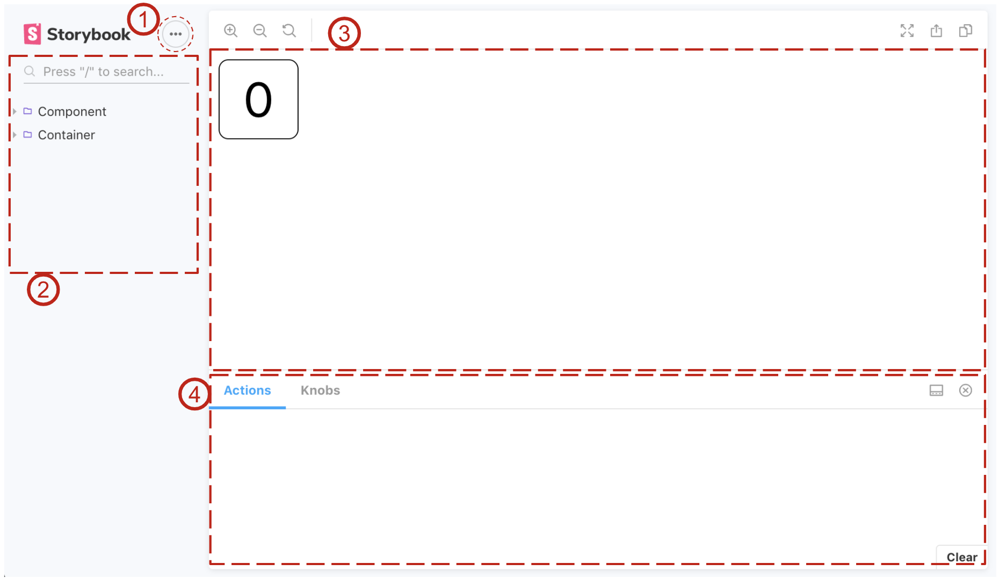

# 1. Documents

1. 以下のサイトを開く
   https://github.com/access-company/webfrontend_intro
2. 右上の「Fork」ボタンを押下
3. 自身のアカウントを選択

自身のアカウントへリポジトリが Fork されます。任意のディレクトリに移動して、**Fork されたリポジトリ** （`https://github.com/[YourGitAccountName]/webfrontend_intro.git`）を git clone してください。clone 後に依存モジュールをインストール（1 回のみ）した後、npm start コマンドを実行して、本研修資料を開いてください。

```bash
$ cd (任意のディレクトリ)
$ git clone https://github.com/[YourGitAccountName]/webfrontend_intro.git   // Your account repository
$ cd webfrontend-intro/react/docs
$ npm install
$ npm start

http://localhost:8000
```

# 2. MindMap（任意）

MindMap の表示は、[MindMaster](https://www.edrawsoft.com/jp/mindmaster/) というソフトウェアを使っています。

[MindMaster の installer をダウンロード](https://drive.google.com/open?id=1txrzEQD-_DutWx6bciAL1vM8hMUAkRlV)

[React 研修の MindMap ファイル(react_training.emmx)](https://drive.google.com/open?id=1XNs1w0YVVRLVVV03vuULRP-_WNv6nM4-)

MindMap の内容を確認したい方は、MindMaster で react_training.emmx ファイルを開いてください。react_training.emmx の内容は、本研修資料と同じです。

研修中は、react_training.emmx の内容を主に画面共有します。受講生の方々は、本研修資料（ https://access-company.github.io/webfrontend_intro/react/ ）を手元で見れるようにしてください。

# 3. 演習問題

React 研修の演習問題は webfrontend_intro/react/exercise 内に格納されています。

下記コマンドで準備は完了します。

```bash
$ cd react/exercise
$ npm install
```

対象の演習問題を環境変数 `TARGET` に格納し、`npm run dev` で実行します。

演習問題ファイルは react/exercise/$TARGET に格納されています。

```bash
# 演習問題ファイルは react/exercise/C01/Q1 に入っている
$ TARGET=C01/Q1 npm run dev
```

# 4. サンプル： 電卓アプリ

React のサンプルとして用意した電卓アプリ。

## 4-1. Setup

### 4-1-1. Install

Current directory が docs (webfrontend-intro/react/docs) の時、

```
cd ../sample
npm install
```

### 4-1-2. Working check

各コマンドを打って動作するかチェック

- `npm test`
  - 初期状態ではテストケースがないため、jest だけが動作する
- `npm start`
  - webpack-dev-server が起動し、ブラウザにコンテンツが表示される
- `npm run storybook`
  - storybook が起動し、3 種類のコンポーネントがリストに表示される
- `npm run lint`
  - ESLint と prettier が動作し waring が多数出る

## 4-2. npm Commands

### npm start

webpack-dev-server を起動してビルドしたコンテンツを http://localhost:3000 に表示します。  
コードを変更すると自動的に更新されます。

### npm test

ユニットテストを実行します。

### npm run build

ソースファイルをビルドします。

### npm run storybook

Storybook を起動します。

### npm run lint

ESLint と prettier によるコードスタイルのチェックが実行されます。

## 4-3. Storybook

### What is Storybook?

Storybook は UI 上で用いるコンポーネントの一覧（カタログ）を作成するツールです.  
コンポーネント単位でのスタイルの確認や `props` による表示の変化等を確認する際に便利です.  
Addon も豊富で, 用途や目的に合わせて Storybook に様々な機能を追加できます.

### Stories file

各コンポーネントの表示内容を指定するファイル.今回はあらかじめ記述済み.  
表示内容はコンポーネントごとの `**/*.stories.tsx` にて定義しているので, 実際の記述が気になる人はチェック.

### Run storybook

1. `npm install`  
   (初回セットアップをしていない場合)
2. `npm run storybook`

##### NOTE

- ターミナル側で一度起動するとソースコードの変更に応じて, 自動的に再ビルドされます.  
  ビルド後, Storybook を表示しているブラウザ側も自動的に更新されます.
  - ただし CSS のみの変更はフックされないので、変更した場合は手動でブラウザ側を更新してください.
  - ビルド時にビルドエラーが起きると, Storybook 側にもエラーが表示されます.  
    修正を行えば自動的に再ビルドされて自動更新されるため, Storybook 自体を再起動する必要はありません.
- 今回はポート番号を指定していないので, Storybook 起動ごとに異なるポート番号が指定されます.

### Features

当サンプルでの Storybook の機能を紹介します.



1. Shortcuts

- メニューの表示非表示といった Storybook の操作とショートカットが表示されるメニュー

2. コンポーネント一覧

- `*.stories.tsx` ファイルが存在するコンポーネントの一覧
- クリックで表示するコンポーネントの切り替え

3. コンポーネント表示部

- コンポーネントを表示するエリア
- クリックやキー入力が効き, 特定のイベント発火を確認可能

4. Addon 表示部

- Actions: `console.log` の結果やイベントの内容を出力
- Knobs: `props` 等に渡す値を任意のものに変更
  - 例: `Button` に表示するテキストの変更, `Label` で表示する数値の変更 等
