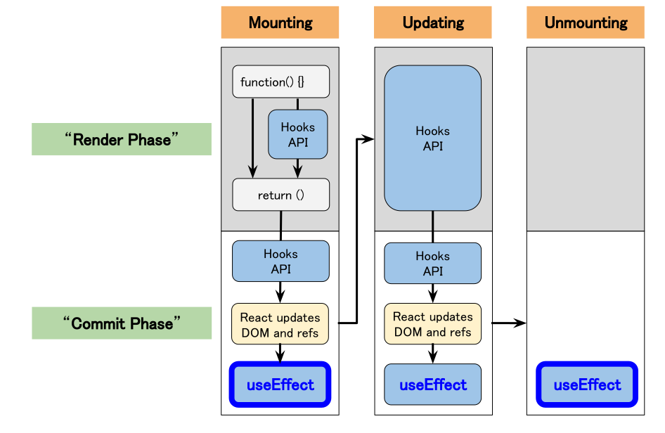

プログラミングおよび React コンポーネントにおける「副作用」とは何なのかについて考えていきます。

# 副作用とは？

副作用とは、

- 引数以外の要因で結果が変わる関数
- 関数の外に影響を与える関数

のことです。


`useState`も副作用の一種です。

副作用は、コンポーネントの再利用性が損なわれたり、ユニットテストが書きづらくなるなどの
多くのデメリットがあります。とはいえ、Web フロントエンドの世界では、副作用にあふれているため、上手に付き合っていかなければなりません。

具体的には、どのような副作用があるのでしょうか？

1. `useState`
2. DOM を変更する
3. Web API（HTTP, WebSocket 等）を使った通信
4. グローバル変数の値を書き換える

ここでは、2〜4 のような副作用を扱う `useEffect` API の導入を行います。

# useEffect API の導入

副作用をコンポーネントに含める場合は、`useEffect` Hooks API を使います。
副作用となる処理をコールバックとして記述します。その副作用となる処理に依存する変数を
依存リストに含めます。

```javascript
useEffect(
  () => {
    // TODO: 副作用をここに書く
  },
  [
    /* 副作用実装の依存リスト */
  ]
);
```

## コンポーネントの描画の度に副作用を実行する

第 2 引数の依存リストを省略することで、副作用を描画の度に必ず実行します。

下記コードはその例です`Counter`コンポーネントが再描画される度に
`useEffect`で実装した `document.title` が呼び出されます。

```bash
# react/exercise にて
$ TARGET=C12/Sample1 npm run dev
```

```typescript
const Counter: FC = () => {
  const [count, setCount] = useState(0);

  useEffect(() => {
    document.title = `You cliked ${count} times`;
  }); // 依存リストを省略

  return (
    <>
      <p>You clicked {count} times</p>
      <button onClick={() => setCount(count + 1)}>Click me</button>
    </>
  );
};
```

## 副作用の実行を抑制したい

副作用を毎回実行したくない状況が発生することが想定されます。
そういうときは、`useEffect`の第 2 引数（依存リスト）を使います。

```javascript
useEffect(doEffect, deps); // depsはArray型
```

たとえば、`count`が前回のレンダーから変更されたときのみ、副作用を実行するには下記のように書き換えます。

```javascript
useEffect(() => {
  document.title = `You cliked ${count} times`;
}, [count]);
```

下記のような例では、`id`または`name`のどちらか前回のレンダーから変更されたときに
副作用を実行します。

```javascript
useEffect(() => {
  fetchUserData(id, name).then((profile) => {
    setAvatar(profile.avatar);
  });
}, [id, name]);
```

依存リストに指定する値には、前章で説明した値の同一性を考慮する必要があります。
基本的には、Primitive Type を依存リストに含めるような実装としてください。
Object 型、Array 型、Function 型を依存リストに含めるような実装となる場合は、
値の同一性に注意を払う必要があります。多くの場合、依存リストに Object 型、Array 型、Function 型を含めるようなケースは実装が複雑化していると思ってください。

# React コンポーネントにおける 2 種類の副作用

副作用は、大きく分けて 2 つに分けることができます。

- クリーンナップを必要としない副作用
- クリーンナップを必要とする副作用

## クリーンナップを必要とする副作用

「クリーンナップを必要とする」とは、どういうことかについて説明します。
一般的なプログラミングにおいて、状態を持つようなケースでは、データのクリーンナップが
必要となることが頻繁にあります。例えば、以下のような追となる関数が存在したとします。
アプリ実装において、後処理が抜けていた場合、どのような問題が発生するでしょうか？

```
new - delete
create - destory
add - remove
open - close
connect - disconnect
  :
```

よくある問題は、メモリリーク、アプリケーションの強制終了、予期せぬ不具合などです。
React におけるクリーンナップの実装は、クリーンナップ処理を `useEffect`内に一緒に書くことで、以下のメリットが得られます。

- 実装漏れを防ぐ効果
- 追となる処理をまとめておくことでユニットテストが簡単にかける
- コードリーディングの向上

**React におけるクリーンナップ処理は、マウントとアンマウントのタイミングで実行されます。**

実装パターンは下記の通りです。

```javascript
useEffect(() => {
  // マウント時の処理
  // クリーンナップ前の副作用の実行

  return () => {
    // アンマウント時の処理
    // TODO: クリーンナップ処理
  };
}, []);
```



### クリーンナップの実装例

```javascript
useEffect(() => {
  const socket = new WebSocket('ws://localhost:8000')
  const handleMessage(e) {
    console.log(`Message from server ${e.data}`)
  }
  socket.addEventListener('message', handleMessage)

  // クリーンナップ処理の関数を返す
  return () => {
    socket.removeEventListener('message', handleMessage)
    socket.close()
  }
}, [])　// 注: depsを空にすること
```

## クリーンナップを必要としない副作用

```javascript
/** 使用例 */

  useEffect(() => {
    fetchAPI()
  })

  useEffect(() => {
    fetchAPI()
  }, [])

  useEffect(() =>
    doSomething1(dep1)
    doSomething2(dep2)
  }, [dep1, dep2])
```

コンポーネントの実行の度に `useEffect` も実行しようとする特徴を持ちます。
とはいえ、`useEffect`の実行を抑制したい場合があります。そのときは、
`useEffect`の第 2 引数（依存リスト）を使います。

`useEffect`のクリーンナップを必要とするコールバックの追は、
下記の太青色に当たります。


# ESLint: react-hooks/exhaustive-deps ルール

実際の開発の現場では、eslint-plugin-react-hooks パッケージを導入し、さらに、
`"react-hooks/exhaustive-deps": "warn"` を有効にすることをお勧めします。

このルールを適用すると、依存リストの不足などを Linter が警告してくれます。

```
// React公式より

We recommend using the exhaustive-deps rule as part of our eslint-plugin-react-hooks package. It warns when dependencies are specified incorrectly and suggests a fix.
cf. Hooks API Reference – React
```

prettier を導入していた場合、依存リストに値の同一性が保証されている関数オブジェクトが自動的に挿入される場合があります。依存リストの自動挿入を無効化したい場合は、依存リストに対して、eslint-disable を適用してください。

```javascript
useEffect(() => {
  // eslint-disable-next-line react-hooks/exhaustive-deps
}, []);
```

# useEffect のまとめ

## コンポーネントの描画の度に副作用を実行したい

```javascript
useEffect(() => {
  doEffect();
});
```

## コンポーネントの描画時に依存リストが変更されたときだけ副作用を実行したい

```javascript
useEffect(() => {
  doEffect();
}, [deps]);
```

## コンポーネントの Mount と Unmount のときだけ副作用を実行したい

```javascript
useEffect(() => {
  doEffect();
  return () => {
    cleanup();
  };
  // eslint-disable-next-line react-hooks/exhaustive-deps
}, []);
```

# Suspense

## Suspense の概要

コンポーネントが Mounte されても、そのコンポーネントのレンダリングに必要な情報が揃うまで、「ローディング中なのでまだレンダリングできない」という趣旨の画面を表示するべきです。

単純な処理では、元となる情報がない状態でレンダリング処理が成立せず、DOM への反映もできない、ということになってしまいます。

Suspense というコンポーネントは、JavaScript の try-catch 文のようにレンダリングがサスペンドしたコンポーネントを補足して、例外的な画面表示を構築することが機能です。

## Suspense のための例外処理

Suspense されるためのコンポーネントは、準備が整っていない間（ローディング中とか）は、`throw (promise as Promise<any>)` を行うように記述します。
このように、コンポーネントが Promise を throw する、という取扱のことを、サスペンドすると呼びます。

それ以外の、コンポーネントレンダリングに支障がない状態なら、通常通りです。
例えば `Promise<any>` でない例外を発する、通常のコーディングミスは Suspense には捕捉されません。

<details>
<summary>コンポーネントの例</summary>

与えられた Promise が完了するまでサスペンドし、完了すればアドレスカードをレンダリングする例

```typescript
import { useRef, useEffect } from 'react';

const Card = ({ promise }: { promise: Promise<Value> }) => {
  const data = useRef<Value>();
  useEffect(() => {
    promise.then((result: Value) => (data.current = result));
  }, [promise]);

  if (data.current) {
    return (
      <div className="card">
        <p>name: {data.current.name}</p>
        <p>address: {data.current.address}</p>
      </div>
    );
  } else {
    throw promise;
  }
};
```

</details>

## Suspense で囲む

「Suspense のための例外処理」をレンダリングすると、開発者コンソールにエラーが現れ、画面は描画されないはずです。

「ローディング中」のような画面を描画して待ち、Promise 完了で直ちにアドレスカード描画をするためには、`<Suspense>...</Suspense>`で`<Card />`を囲みます。

<details>
<summary>コンポーネントの例</summary>

Card コンポーネントを囲み、ローディング中は「Loading...」という表記をする例

```typescript
import { type FC, Suspense } from 'react';

const CardPair: FC = () => {
  const result = fetch('https://example.com/api/cards.json');

  return (
    <div className="pair">
      <h1>Card Pair</h1>
      <Suspense fallback={<p>Loading...</p>}>
        <Card promise={result.then((o) => o.cards[0])} />
        <Card promise={result.then((o) => o.cards[1])} />
      </Suspense>
    </div>
  );
};
```

</details>

例示したコードは、画面表示直後には「Loading...」と描画し、`https://example.com/api/cards.json`の受信直後に Card コンポーネントが再描画されます。

## 【課題 12-1】Web API（Dummy）から取得したユーザプロファイルを表示する

「条件付きレンダー」と`useEffect`と`useState`の両方を使った課題です。

以下の実装の要件を満たしてください。

- Dummy の Web API を呼び出す `fetchDummyProfile()` を使って、ユーザプロファイルを取得する
- `useEffect` と `Suspense` を使う
- Dummy の Web API のリクエストは、`UserProfile`コンポーネントの初回レンダーの 1 回のみとする
- Dummy の Web API のリクエスト中は、「Loading...」を画面に表示する
- 読み込み完了後に、ユーザプロファイルを画面に反映する

期待する表示は、下図の通りです。


```bash
# react/exercise にて
$ TARGET=C12/Q1 npm run dev
```

編集対象ファイル: `react/exercise/C12/Q1/index.tsx`
